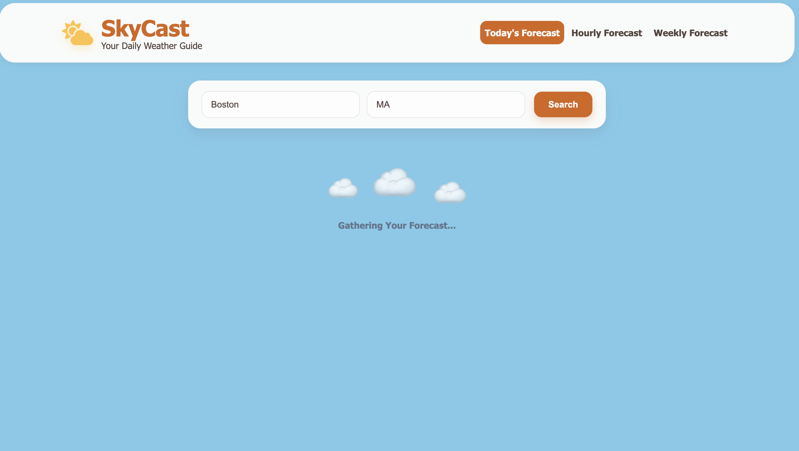
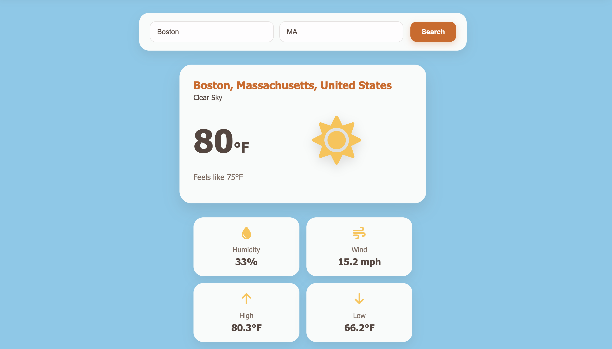
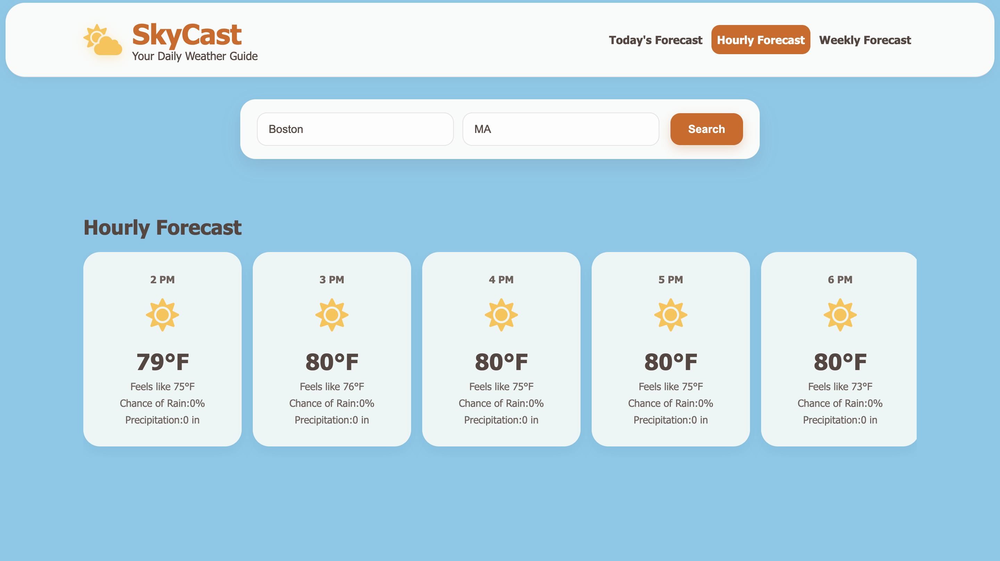
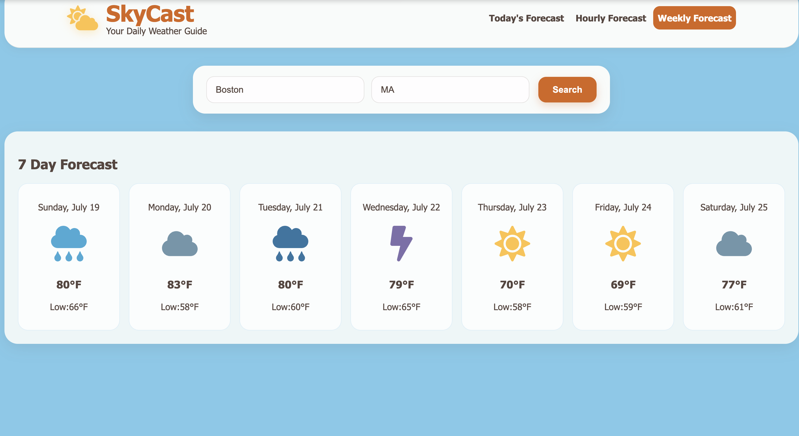
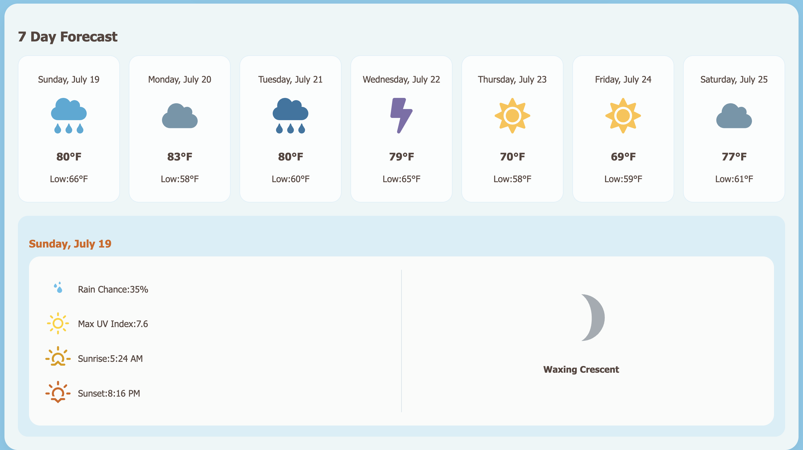

# SkyCast | Weather App

A weather app built with React that provides current conditions, hourly forecasts, weekly forecasts, as well as additional weather details.

Features:

- Real-time weather data
- Hourly Forecast
- Weekly (7 Day) Forecast
- Extra Details such as Moon phases, Sunrise/Sunset Timings, UV Index, Humidity, Wind speed, etc.

Technology:

- React
- JavaScript/JSX
- Vite
- CSS3
- Open-Meteo API
- Visual Crossing API
- React Router
- React Icons

## Pictures of Website

### HomePage

### Today's Forecast

### Hourly Forecast

### Weekly Forecast

### Weather Details

